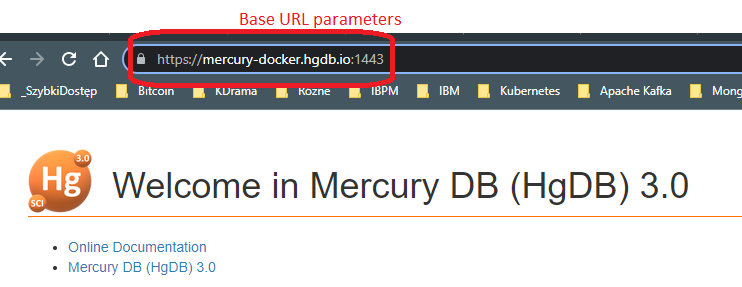
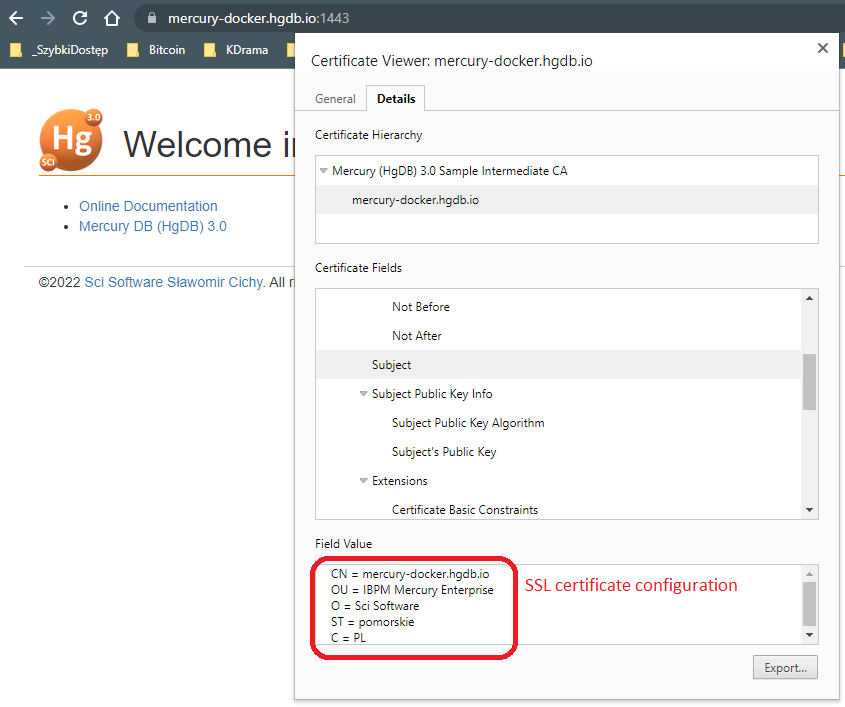

# Single node IBPM Mercury (HgDB)

Follow picture describes architecture of Single node IBPM Mercury (HgDB) compose


## Containers list

The composition consists of the following images:
- the [PostgreSQL](https://hub.docker.com/repository/docker/ibpm/postgres) container.
- the [Apache ActiveMQ](https://hub.docker.com/repository/docker/ibpm/activemq) container.
- the [OpenLDAP](https://hub.docker.com/repository/docker/ibpm/openldap) container.
- the [Iron - POI Excel Serwer](https://hub.docker.com/repository/docker/ibpm/poi-server) container.
- the [Clustered Cache](https://hub.docker.com/repository/docker/ibpm/ehcache) container.
- the [IBPM Mercury (HgDB)](https://hub.docker.com/repository/docker/ibpm/mercury) container.
- the [IBPM Mercury (HgDB) LoadBalancer](https://hub.docker.com/repository/docker/ibpm/mercury-lb) container.

| Name     | Image | Depends on | Component | 
|------------|-------------|-------------|-------------|
| mercury-1 | ibpm/mercury-lb:mercury-hgdb-3.0 | mercury-node1-1 | IBPM Mercury LoadBalancer |
| mercury-node1-1 | ibpm/mercury:mercury-hgdb-3.0.3.2.11 | activemq&#8209;1<br/>poi&#8209;server&#8209;node1&#8209;1<br/>ehcache&#8209;node1&#8209;1<br/>postgres&#8209;db&#8209;1<br/>openldap&#8209;1  | IBPM Mercury (HgDB) (Single Node1) |
| poi-server-node1-1 | ibpm/poi-server:mercury-hgdb-3.0 | activemq&#8209;1 | Iron POI Excel Server (Single Node1) |
| ehcache-node1-1 | ibpm/ehcache:mercury-hgdb-3.0 | - | Ehcache Cluster (Single Node1) |
| activemq-1 | ibpm/activemq:mercury-hgdb-3.0 | postgres&#8209;db&#8209;1 |Apache Active MQ (Backend service) |
| postgres-db-1 | ibpm/postgres:mercury-hgdb-3.0 | - |PostgreSQL Database (Backend service) |
| openldap-1 | ibpm/openldap:mercury-hgdb-3.0 | - | OpenLDAP (Backend service) |

## Run compose step-by-step

Sample definition of compose is in file [docker-compose.yml](docker-compose.yml).

### Step 1 - prepare volumes
Compose require volumes, where be stored system data. You should prepare follow volumes:

| Volume     | Container | Sample location | Description |
|------------|-------------|-------------|-------------|
| nginx&#8209;conf | mercury&#8209;1 | /d/mercury/nginx/conf | Configuration of IBPM Mercury (HgDB) load balancer |
| nginx&#8209;html | mercury&#8209;1 | /d/mercury/nginx/html | Static HTML pages of IBPM Mercury (HgDB) load balancer e.g. custom error HTML pages 404.html|
| certificate_center | mercury&#8209;1 | /d/mercury/certificate_center | Data for generation SSL Self&#8209;sign certificates |
| postgres&#8209;db | postgres&#8209;db&#8209;1 | /d/mercury/postgres&#8209;db | PostgreSQL database data files |
| openldap | openldap&#8209;1 | /d/mercury/openldap | OpenLDAP database data files|
| slapd&#8209;d | openldap&#8209;1 | /d/mercury/slapd.d | OpenLDAP database configuration files |
| poi&#8209;server | poi&#8209;server&#8209;node1&#8209;1 | /d/mercury/poi&#8209;server | Iron &#8209; POI Excel Server document repository folder |
| mercury&#8209;upload | mercury&#8209;node1&#8209;1 | /d/mercury/mercury&#8209;upload | IBPM Mercury (HgDB) document repository folder |
| mercury&#8209;lucene | mercury&#8209;node1&#8209;1 | /d/mercury/mercury&#8209;lucene | IBPM Mercury (HgDB) Lucene index data folder |

See section "volumes" in file [docker-compose.yml](docker-compose.yml), line 7:
```
volumes:
  nginx-conf:
    driver: local
    driver_opts:
      o: bind
      type: none
      device: /d/mercury/nginx/conf
  nginx-html:
    driver: local
    driver_opts:
      o: bind
      type: none
      device: /d/mercury/nginx/html
  certificate_center:
    driver: local
    driver_opts:
      o: bind
      type: none
      device: /d/mercury/certificate_center
  postgres-db:
    driver: local
    driver_opts:
      o: bind
      type: none
      device: /d/mercury/postgres-db
  openldap:
    driver: local
    driver_opts:
      o: bind
      type: none
      device: /d/mercury/openldap
  slapd-d:
    driver: local
    driver_opts:
      o: bind
      type: none
      device: /d/mercury/slapd.d            
  poi-server:
    driver: local
    driver_opts:
      o: bind
      type: none
      device: /d/mercury/poi-server            
  mercury-upload:
    driver: local
    driver_opts:
      o: bind
      type: none
      device: /d/mercury/mercury-upload            
  mercury-lucene:
    driver: local
    driver_opts:
      o: bind
      type: none
      device: /d/mercury/mercury-lucene 
```

### Step 2 - set parameters for environment

Please set custom environment variables for compose by editing file [mercury-hgdb.env](mercury-hgdb.env). Required parameters are:

#### Base parameters

Protocol and host name definition.
| Variable       | Sample value | Description |
|------------|-------------|-------------|
| HGDB_URL_SCHEMA | https | IBPM Mercury (HgDB) node URL schema. Possible values: "http" or "https" |
| HGDB_URL_HOST | mercury&#8209;docker.hgdb.org | IBPM Mercury (HgDB) node URL host name (with domain) e.g. "mercury&#8209;docker.hgdb.org"  |
| HGDB_URL_PORT | 1443 | IBPM Mercury (HgDB) service URL port number e.g. "1443"  |



#### SSL certificate configuration

| Variable       | Sample value | Description |
|------------|-------------|-------------|
| SERVER_NAME | mercury&#8209;docker | IBPM Mercury (HgDB) host name without domain name |
| DOMAIN_NAME | hgdb.io | IBPM Mercury (HgDB) host domain name |
| COUNTRY | PL | [SSL certificate country code](https://www.digicert.com/kb/ssl-certificate-country-codes.htm) e.q. 'US' for United States of America, 'PL' for Poland |
| STATE | pomorskie | SSL certificate state name |
| CITY | Bojano | SSL certificate city name |
| ORG_NAME | Sci Software | SSL certificate organization name |
| EMAIL | info@scisoftware.pl | SSL certificate contact email address |



#### System credentials

| Variable       | Description |
|------------|-------------|
| POSTGRES_PASSWORD | Main password for PostgreSQL administrator user |
| HGDB_USER_PASSWORD | Password database user for IBPM Mercury (HgDB) system |
| MQ_ADMIN_PASSWORD | ActiveMQ 'admin' user password, default value: admin |
| MQ_USER_PASSWORD | ActiveMQ 'user' user password, default value: user  |
| SECURITY_TOKEN | Security token for authentication SOAP requests |

#### LDAP init data

| Variable       | Sample value | Description |
|------------|-------------|-------------|
| LDAP_ORG_DC | scisoftware | Acronym of organization name e.g. "scisoftware" |
| LDAP_OLC_SUFFIX | dc=scisoftware,dc=pl | Main root DN (Distinguished Name); in DN should be used value of LDAP_ORG_DC variable as DC attribute by pattern: dc=${LDAP_ORG_DC},dc=example,dc=com; e.g. "dc=scisoftware,dc=pl" |
| LDAP_ROOT_CN | manager | Administrator (manager) user CN (Common Name) attribute e.g. "manager" |
| LDAP_ROOT_PASSWD | secret | Administrator (manager) user password |
| LDAP_TECHNICAL_USER_CN | FrontendAccount | Technical user name, with read privileges to all entries |
| LDAP_TECHNICAL_USER_PASSWD | secret | Technical user password, default value: "secret"|

See sample variables definition in file [mercury-hgdb.env](mercury-hgdb.env):
```
HGDB_URL_SCHEMA=https
HGDB_URL_HOST=mercury-docker.hgdb.io
HGDB_URL_PORT=1443

# SSL certificate data - START
SERVER_NAME=mercury-docker
DOMAIN_NAME=hgdb.io
COUNTRY=PL
STATE=pomorskie
CITY=Bojano
ORG_NAME=Sci Software
EMAIL=info@scisoftware.pl
# SSL certificate data - END

# System credentials - START
POSTGRES_PASSWORD=secret
HGDB_USER_PASSWORD=mercury01
MQ_ADMIN_PASSWORD=admin
MQ_USER_PASSWORD=user
SECURITY_TOKEN=3e6769457de88565bfdeb3ba3765bec2
# System credentials - END

# LDAP init data - START
LDAP_ORG_DC=scisoftware
LDAP_OLC_SUFFIX=dc=scisoftware,dc=pl
LDAP_ROOT_CN=manager
LDAP_ROOT_PASSWD=secret
LDAP_TECHNICAL_USER_CN=FrontendAccount
LDAP_TECHNICAL_USER_PASSWD=secret
# LDAP init data - END

#####################################
# Don't change it - START
HGDB_NODES=1
HGDB_NODE=node1
# Don't change it - END
#####################################
``` 

### Step 3 - Start compose
Launching the compose by follow command line:
```
docker compose --env-file mercury-hgdb.env up
```

